# Product Map: FitTrack

> A fitness tracking app that helps users set goals, track workouts, and compete with friends.

**Platform:** iOS
**Last Updated:** 2024-01-15

---

## Legend

| Style | Meaning | Description |
|-------|---------|-------------|
| 🔴 Red border | Human-critical | Must be human-designed - first impressions, conversions, emotional peaks |
| 🟡 Yellow border | Human-preferred | Human recommended - pattern-setters, complex interactions |
| 🟢 Green dashed | AI-suitable | AI can generate after human patterns exist |
| ✅ Green fill | Complete | Screen is finished |
| 👤 Name | Assigned | Shows designer owner |
| 🤖 AI | AI-assigned | Will be generated by AI |

---

## Full Product Map

```mermaid
flowchart TB
    subgraph onboarding[" 🚀 Onboarding"]
        welcome["Welcome<br/>👤 Sarah ✅"]
        signup["Signup<br/>👤 Sarah"]
        profile_setup["Profile Setup<br/>👤 Sarah"]
        goals["Set Goals<br/>👤 Mike"]
        login["Login"]
        forgot["Forgot Password<br/>🤖 AI"]
    end

    subgraph dashboard[" 🏠 Dashboard"]
        home["Home<br/>👤 Sarah"]
        stats["Stats Overview<br/>🤖 AI"]

        subgraph home_states[" 📊 Home States"]
            home_empty["Empty State<br/>🤖 AI"]
            home_loading["Loading<br/>🤖 AI"]
        end
    end

    subgraph workouts[" 💪 Workouts"]
        workout_list["Workout List<br/>🤖 AI"]
        workout_detail["Workout Detail<br/>👤 Mike"]
        active_workout["Active Workout<br/>👤 Mike"]
        workout_complete["Workout Complete<br/>👤 Sarah"]

        subgraph workout_states[" 📊 Workout States"]
            rest_timer["Rest Timer<br/>🤖 AI"]
            exercise_demo["Exercise Demo<br/>🤖 AI"]
        end
    end

    subgraph social[" 👥 Social"]
        friends["Friends List<br/>🤖 AI"]
        challenges["Challenges<br/>👤 Mike"]
        leaderboard["Leaderboard<br/>🤖 AI"]
        challenge_detail["Challenge Detail<br/>🤖 AI"]
        challenge_complete["Challenge Won<br/>👤 Sarah"]
    end

    subgraph settings[" ⚙️ Settings"]
        settings_main["Settings<br/>🤖 AI"]
        profile["Edit Profile<br/>🤖 AI"]
        notifications["Notifications<br/>🤖 AI"]
        subscription["Subscription<br/>👤 Mike"]
    end

    %% Connections - Onboarding
    welcome --> signup
    welcome --> login
    signup --> profile_setup
    profile_setup --> goals
    goals --> home
    login --> home
    login --> forgot

    %% Connections - Dashboard
    home --> stats
    home --> workout_list
    home --> friends
    home --> settings_main

    %% Connections - Workouts
    workout_list --> workout_detail
    workout_detail --> active_workout
    active_workout --> rest_timer
    active_workout --> exercise_demo
    active_workout --> workout_complete

    %% Connections - Social
    friends --> challenges
    challenges --> challenge_detail
    challenge_detail --> leaderboard
    challenge_detail --> challenge_complete

    %% Connections - Settings
    settings_main --> profile
    settings_main --> notifications
    settings_main --> subscription

    %% Styling - Human Critical (red, solid, thick)
    style welcome stroke:#dc2626,stroke-width:3px,fill:#dcfce7
    style signup stroke:#dc2626,stroke-width:3px
    style profile_setup stroke:#dc2626,stroke-width:3px
    style home stroke:#dc2626,stroke-width:3px
    style active_workout stroke:#dc2626,stroke-width:3px
    style workout_complete stroke:#dc2626,stroke-width:3px
    style challenge_complete stroke:#dc2626,stroke-width:3px

    %% Styling - Human Preferred (yellow, solid)
    style goals stroke:#f59e0b,stroke-width:2px
    style login stroke:#f59e0b,stroke-width:2px
    style workout_detail stroke:#f59e0b,stroke-width:2px
    style challenges stroke:#f59e0b,stroke-width:2px
    style subscription stroke:#f59e0b,stroke-width:2px

    %% Styling - AI Suitable (green, dashed)
    style forgot stroke:#22c55e,stroke-width:2px,stroke-dasharray:5 5
    style stats stroke:#22c55e,stroke-width:2px,stroke-dasharray:5 5
    style home_empty stroke:#22c55e,stroke-width:2px,stroke-dasharray:5 5
    style home_loading stroke:#22c55e,stroke-width:2px,stroke-dasharray:5 5
    style workout_list stroke:#22c55e,stroke-width:2px,stroke-dasharray:5 5
    style rest_timer stroke:#22c55e,stroke-width:2px,stroke-dasharray:5 5
    style exercise_demo stroke:#22c55e,stroke-width:2px,stroke-dasharray:5 5
    style friends stroke:#22c55e,stroke-width:2px,stroke-dasharray:5 5
    style leaderboard stroke:#22c55e,stroke-width:2px,stroke-dasharray:5 5
    style challenge_detail stroke:#22c55e,stroke-width:2px,stroke-dasharray:5 5
    style settings_main stroke:#22c55e,stroke-width:2px,stroke-dasharray:5 5
    style profile stroke:#22c55e,stroke-width:2px,stroke-dasharray:5 5
    style notifications stroke:#22c55e,stroke-width:2px,stroke-dasharray:5 5
```

---

## Section Details

### 🚀 Onboarding

```mermaid
flowchart LR
    subgraph onb[" 🚀 Onboarding Flow"]
        direction LR
        welcome["Welcome<br/>━━━━━━━━━<br/>Hero animation<br/>Value props<br/>Get Started CTA<br/>━━━━━━━━━<br/>👤 Sarah ✅"]

        signup["Signup<br/>━━━━━━━━━<br/>Email/password<br/>Apple Sign In<br/>Google Sign In<br/>━━━━━━━━━<br/>👤 Sarah"]

        profile_setup["Profile Setup<br/>━━━━━━━━━<br/>Photo upload<br/>Name/age/weight<br/>Fitness level<br/>━━━━━━━━━<br/>👤 Sarah"]

        goals["Set Goals<br/>━━━━━━━━━<br/>Goal cards<br/>Custom goal<br/>Recommended<br/>━━━━━━━━━<br/>👤 Mike"]
    end

    welcome --> signup --> profile_setup --> goals

    style welcome stroke:#dc2626,stroke-width:3px,fill:#dcfce7
    style signup stroke:#dc2626,stroke-width:3px
    style profile_setup stroke:#dc2626,stroke-width:3px
    style goals stroke:#f59e0b,stroke-width:2px
```

| Screen | Classification | Owner | Status | States | Notes |
|--------|---------------|-------|--------|--------|-------|
| Welcome | 🔴 Human-critical | Sarah | ✅ Complete | default | First impression, hero animation, brand moment |
| Signup | 🔴 Human-critical | Sarah | In progress | default, loading, error | Conversion screen, social auth |
| Profile Setup | 🔴 Human-critical | Sarah | Not started | default, uploading, error | Personal data collection |
| Set Goals | 🟡 Human-preferred | Mike | Not started | default, selecting | Pattern-setter for goal cards |
| Login | 🟡 Human-preferred | - | Not started | default, loading, error, biometric | Secondary entry |
| Forgot Password | 🟢 AI-suitable | AI | - | default, sending, sent | Simple form pattern |

---

### 💪 Workouts

```mermaid
flowchart LR
    subgraph work[" 💪 Workout Flow"]
        direction LR
        list["Workout List<br/>━━━━━━━━━<br/>Category tabs<br/>Workout cards<br/>Search/filter<br/>━━━━━━━━━<br/>🤖 AI"]

        detail["Workout Detail<br/>━━━━━━━━━<br/>Preview video<br/>Exercise list<br/>Start button<br/>━━━━━━━━━<br/>👤 Mike"]

        active["Active Workout<br/>━━━━━━━━━<br/>Exercise view<br/>Timer/reps<br/>Next/prev<br/>━━━━━━━━━<br/>👤 Mike"]

        complete["Complete!<br/>━━━━━━━━━<br/>Celebration<br/>Stats summary<br/>Share CTA<br/>━━━━━━━━━<br/>👤 Sarah"]
    end

    list --> detail --> active --> complete

    style list stroke:#22c55e,stroke-width:2px,stroke-dasharray:5 5
    style detail stroke:#f59e0b,stroke-width:2px
    style active stroke:#dc2626,stroke-width:3px
    style complete stroke:#dc2626,stroke-width:3px
```

| Screen | Classification | Owner | Status | States | Notes |
|--------|---------------|-------|--------|--------|-------|
| Workout List | 🟢 AI-suitable | AI | - | default, loading, empty, filtering | List pattern from Home |
| Workout Detail | 🟡 Human-preferred | Mike | Not started | default, loading | Pattern-setter for detail views |
| Active Workout | 🔴 Human-critical | Mike | Not started | exercising, resting, paused | Core experience, complex interaction |
| Workout Complete | 🔴 Human-critical | Sarah | Not started | default, sharing | Emotional peak, celebration moment |
| Rest Timer | 🟢 AI-suitable | AI | - | counting, done | Simple timer overlay |
| Exercise Demo | 🟢 AI-suitable | AI | - | playing, paused | Video player pattern |

---

## Statistics

| Metric | Count | Percentage |
|--------|-------|------------|
| **Total screens** | 25 | 100% |
| 🔴 Human-critical | 7 | 28% |
| 🟡 Human-preferred | 5 | 20% |
| 🟢 AI-suitable | 13 | 52% |
| Assigned | 12 | 48% |
| Complete | 1 | 4% |

---

## Screen Inventory

| ID | Screen | Section | Classification | Owner | Status | Priority |
|----|--------|---------|----------------|-------|--------|----------|
| onb-welcome | Welcome | Onboarding | 🔴 Human-critical | Sarah | ✅ Complete | P0 |
| onb-signup | Signup | Onboarding | 🔴 Human-critical | Sarah | In progress | P0 |
| onb-profile | Profile Setup | Onboarding | 🔴 Human-critical | Sarah | Not started | P0 |
| onb-goals | Set Goals | Onboarding | 🟡 Human-preferred | Mike | Not started | P0 |
| onb-login | Login | Onboarding | 🟡 Human-preferred | - | Not started | P1 |
| onb-forgot | Forgot Password | Onboarding | 🟢 AI-suitable | AI | - | P2 |
| dash-home | Home | Dashboard | 🔴 Human-critical | Sarah | Not started | P0 |
| dash-stats | Stats Overview | Dashboard | 🟢 AI-suitable | AI | - | P1 |
| dash-empty | Empty State | Dashboard | 🟢 AI-suitable | AI | - | P2 |
| dash-loading | Loading | Dashboard | 🟢 AI-suitable | AI | - | P2 |
| work-list | Workout List | Workouts | 🟢 AI-suitable | AI | - | P1 |
| work-detail | Workout Detail | Workouts | 🟡 Human-preferred | Mike | Not started | P0 |
| work-active | Active Workout | Workouts | 🔴 Human-critical | Mike | Not started | P0 |
| work-complete | Workout Complete | Workouts | 🔴 Human-critical | Sarah | Not started | P0 |
| work-rest | Rest Timer | Workouts | 🟢 AI-suitable | AI | - | P1 |
| work-demo | Exercise Demo | Workouts | 🟢 AI-suitable | AI | - | P1 |
| social-friends | Friends List | Social | 🟢 AI-suitable | AI | - | P1 |
| social-challenges | Challenges | Social | 🟡 Human-preferred | Mike | Not started | P1 |
| social-leader | Leaderboard | Social | 🟢 AI-suitable | AI | - | P2 |
| social-chal-detail | Challenge Detail | Social | 🟢 AI-suitable | AI | - | P1 |
| social-chal-won | Challenge Won | Social | 🔴 Human-critical | Sarah | Not started | P1 |
| set-main | Settings | Settings | 🟢 AI-suitable | AI | - | P2 |
| set-profile | Edit Profile | Settings | 🟢 AI-suitable | AI | - | P2 |
| set-notif | Notifications | Settings | 🟢 AI-suitable | AI | - | P2 |
| set-sub | Subscription | Settings | 🟡 Human-preferred | Mike | Not started | P1 |

---

## AI Generation Dependencies

| AI Screen | Pattern Source | Patterns to Extract | Human Review |
|-----------|---------------|---------------------|--------------|
| Forgot Password | Login | Form layout, single input, CTA | None |
| Stats Overview | Home | Card layout, data visualization | Charts |
| Home Empty | Home | Layout structure, illustration placement | Illustration |
| Home Loading | Home | Skeleton layout, shimmer pattern | None |
| Workout List | Home | List structure, card layout, tabs | None |
| Rest Timer | Active Workout | Timer display, overlay style | None |
| Exercise Demo | Workout Detail | Video player, controls | None |
| Friends List | Home | List layout, avatar + name pattern | None |
| Leaderboard | Friends List | List with ranking, progress bars | None |
| Challenge Detail | Workout Detail | Detail layout, CTA placement | None |
| Settings | Home | Navigation list pattern | None |
| Edit Profile | Profile Setup | Form layout, photo upload | None |
| Notifications | Settings | Toggle list pattern | None |

---

## Designer Workload

| Designer | Critical | Preferred | Total | Focus Area |
|----------|----------|-----------|-------|------------|
| Sarah | 4 | 0 | 4 | Onboarding, celebrations, brand moments |
| Mike | 2 | 4 | 6 | Workouts, goals, challenges |
| AI | 0 | 0 | 13 | States, lists, settings, variations |
| Unassigned | 1 | 1 | 2 | Login, notifications |

---

## Blocking Dependencies

```mermaid
flowchart LR
    subgraph blockers[" 🚧 Critical Path"]
        welcome["Welcome ✅"] --> home["Home"]
        home --> dash_states["Dashboard States"]
        home --> workout_list["Workout List"]
        home --> friends["Friends List"]
        home --> settings["Settings"]

        workout_detail["Workout Detail"] --> rest_timer["Rest Timer"]
        workout_detail --> exercise_demo["Exercise Demo"]

        profile_setup["Profile Setup"] --> edit_profile["Edit Profile"]
    end

    style welcome fill:#dcfce7
    style home stroke:#dc2626,stroke-width:3px
    style workout_detail stroke:#f59e0b,stroke-width:2px
    style profile_setup stroke:#dc2626,stroke-width:3px
```

**Critical blockers:**
1. ⚠️ **Home** not complete - blocks 5 AI screens (Stats, Empty, Loading, Lists, Settings)
2. ⚠️ **Workout Detail** not complete - blocks Rest Timer, Exercise Demo
3. ⚠️ **Profile Setup** not complete - blocks Edit Profile

---

## Next Actions

1. **Complete Home screen** - unblocks 5 AI screens
2. **Complete Workout Detail** - unblocks 2 AI screens
3. **Assign Login screen** - currently unowned
4. **Start Week 1 designs** - Sarah: Signup, Profile Setup; Mike: Goals, Workout Detail

---

*Generated by `/product-design` skill*
