# Product Map: {{PRODUCT_NAME}}

> {{PRODUCT_DESCRIPTION}}

**Platform:** {{PLATFORM}}
**Last Updated:** {{DATE}}

---

## Legend

| Style | Meaning | Description |
|-------|---------|-------------|
| 🔴 Red border | Human-critical | Must be human-designed - first impressions, conversions, emotional peaks |
| 🟡 Yellow border | Human-preferred | Human recommended - pattern-setters, complex interactions |
| 🟢 Green dashed | AI-suitable | AI can generate after human patterns exist |
| ✅ Green fill | Complete | Screen is finished |
| 👤 Name | Assigned | Shows designer owner |
| 🤖 AI | AI-assigned | Will be generated by AI |

---

## Full Product Map

```mermaid
flowchart TB
    subgraph onboarding[" 🚀 Onboarding"]
        welcome["Welcome<br/>👤 {{DESIGNER}}"]
        signup["Signup<br/>👤 {{DESIGNER}}"]
        login["Login"]
        verify["Verify Email<br/>🤖 AI"]
        forgot["Forgot Password<br/>🤖 AI"]
    end

    subgraph core[" 🏠 Core"]
        home["Home<br/>👤 {{DESIGNER}}"]
        feed["Feed<br/>🤖 AI"]
        detail["Detail<br/>🤖 AI"]

        subgraph states[" 📊 States"]
            empty["Empty State<br/>🤖 AI"]
            loading["Loading<br/>🤖 AI"]
            error["Error<br/>🤖 AI"]
        end
    end

    subgraph settings[" ⚙️ Settings"]
        prefs["Preferences<br/>🤖 AI"]
        profile["Profile"]
        account["Account<br/>🤖 AI"]
    end

    %% Connections
    welcome --> signup
    welcome --> login
    signup --> verify
    login --> forgot
    login --> home
    home --> feed
    feed --> detail
    home --> states
    home --> settings
    settings --> profile

    %% Styling - Human Critical (red, solid, thick)
    style welcome stroke:#dc2626,stroke-width:3px
    style signup stroke:#dc2626,stroke-width:3px
    style home stroke:#dc2626,stroke-width:3px

    %% Styling - Human Preferred (yellow, solid)
    style login stroke:#f59e0b,stroke-width:2px
    style profile stroke:#f59e0b,stroke-width:2px

    %% Styling - AI Suitable (green, dashed)
    style verify stroke:#22c55e,stroke-width:2px,stroke-dasharray:5 5
    style forgot stroke:#22c55e,stroke-width:2px,stroke-dasharray:5 5
    style feed stroke:#22c55e,stroke-width:2px,stroke-dasharray:5 5
    style detail stroke:#22c55e,stroke-width:2px,stroke-dasharray:5 5
    style empty stroke:#22c55e,stroke-width:2px,stroke-dasharray:5 5
    style loading stroke:#22c55e,stroke-width:2px,stroke-dasharray:5 5
    style error stroke:#22c55e,stroke-width:2px,stroke-dasharray:5 5
    style prefs stroke:#22c55e,stroke-width:2px,stroke-dasharray:5 5
    style account stroke:#22c55e,stroke-width:2px,stroke-dasharray:5 5

    %% Completed screens (green fill)
    %% style welcome fill:#dcfce7
```

---

## Section Details

### 🚀 Onboarding

```mermaid
flowchart LR
    subgraph onb[" 🚀 Onboarding Flow"]
        direction LR
        welcome["Welcome<br/>━━━━━━━━━<br/>Hero image<br/>Value props<br/>CTA buttons<br/>━━━━━━━━━<br/>👤 {{DESIGNER}}"]

        signup["Signup<br/>━━━━━━━━━<br/>Email input<br/>Password<br/>Social auth<br/>━━━━━━━━━<br/>👤 {{DESIGNER}}"]

        verify["Verify Email<br/>━━━━━━━━━<br/>Code input<br/>Resend link<br/>━━━━━━━━━<br/>🤖 AI"]

        login["Login<br/>━━━━━━━━━<br/>Email/pass<br/>Remember me<br/>Biometrics<br/>━━━━━━━━━<br/>Unassigned"]

        forgot["Forgot PW<br/>━━━━━━━━━<br/>Email input<br/>Send reset<br/>━━━━━━━━━<br/>🤖 AI"]
    end

    welcome --> signup
    welcome --> login
    signup --> verify
    login --> forgot

    style welcome stroke:#dc2626,stroke-width:3px
    style signup stroke:#dc2626,stroke-width:3px
    style login stroke:#f59e0b,stroke-width:2px
    style verify stroke:#22c55e,stroke-width:2px,stroke-dasharray:5 5
    style forgot stroke:#22c55e,stroke-width:2px,stroke-dasharray:5 5
```

| Screen | Classification | Owner | Status | States | Notes |
|--------|---------------|-------|--------|--------|-------|
| Welcome | 🔴 Human-critical | {{DESIGNER}} | Not started | default | First impression, sets brand tone |
| Signup | 🔴 Human-critical | {{DESIGNER}} | Not started | default, loading, error | Conversion screen |
| Verify Email | 🟢 AI-suitable | AI | - | default, resending, error | Follows signup pattern |
| Login | 🟡 Human-preferred | - | Not started | default, loading, error | Secondary entry point |
| Forgot Password | 🟢 AI-suitable | AI | - | default, sending, sent | Simple form pattern |

---

### 🏠 Core

[Similar detail view for Core section...]

---

### ⚙️ Settings

[Similar detail view for Settings section...]

---

## Statistics

| Metric | Count | Percentage |
|--------|-------|------------|
| **Total screens** | {{TOTAL}} | 100% |
| 🔴 Human-critical | {{HUMAN_CRITICAL}} | {{HC_PCT}}% |
| 🟡 Human-preferred | {{HUMAN_PREFERRED}} | {{HP_PCT}}% |
| 🟢 AI-suitable | {{AI_SUITABLE}} | {{AI_PCT}}% |
| Assigned | {{ASSIGNED}} | {{ASSIGNED_PCT}}% |
| Complete | {{COMPLETE}} | {{COMPLETE_PCT}}% |

---

## Screen Inventory

| ID | Screen | Section | Classification | Owner | Status | States |
|----|--------|---------|----------------|-------|--------|--------|
| onb-welcome | Welcome | Onboarding | 🔴 Human-critical | - | Not started | default |
| onb-signup | Signup | Onboarding | 🔴 Human-critical | - | Not started | default, loading, error |
| onb-verify | Verify Email | Onboarding | 🟢 AI-suitable | AI | - | default, resending, error |
| onb-login | Login | Onboarding | 🟡 Human-preferred | - | Not started | default, loading, error |
| onb-forgot | Forgot Password | Onboarding | 🟢 AI-suitable | AI | - | default, sending, sent |
| core-home | Home | Core | 🔴 Human-critical | - | Not started | default, loading |
| core-feed | Feed | Core | 🟢 AI-suitable | AI | - | default, loading, empty, error |
| core-detail | Detail | Core | 🟢 AI-suitable | AI | - | default, loading |
| ... | ... | ... | ... | ... | ... | ... |

---

## AI Generation Dependencies

| AI Screen | Pattern Source | Patterns to Extract | Notes |
|-----------|---------------|---------------------|-------|
| Verify Email | Signup | Form layout, input styles, button placement | Similar form structure |
| Forgot Password | Login | Single input form, CTA button | Simplified version |
| Feed | Home | Card layout, list structure, navigation | Repeating card pattern |
| Detail | Home + Feed | Header layout, content sections | Combines patterns |
| Empty State | Home | Layout, illustration style, CTA placement | Brand-consistent |
| Loading | Home | Skeleton layout, shimmer pattern | Match content structure |
| Error | Home | Error illustration, retry button | Brand-consistent |

---

## Next Actions

1. **Assign designers** to human-critical screens
2. **Complete Welcome screen** first (blocks all brand patterns)
3. **Complete Home screen** (blocks core experience patterns)
4. **Review AI-suitable classifications** with team

---

*Generated by `/product-design` skill*
