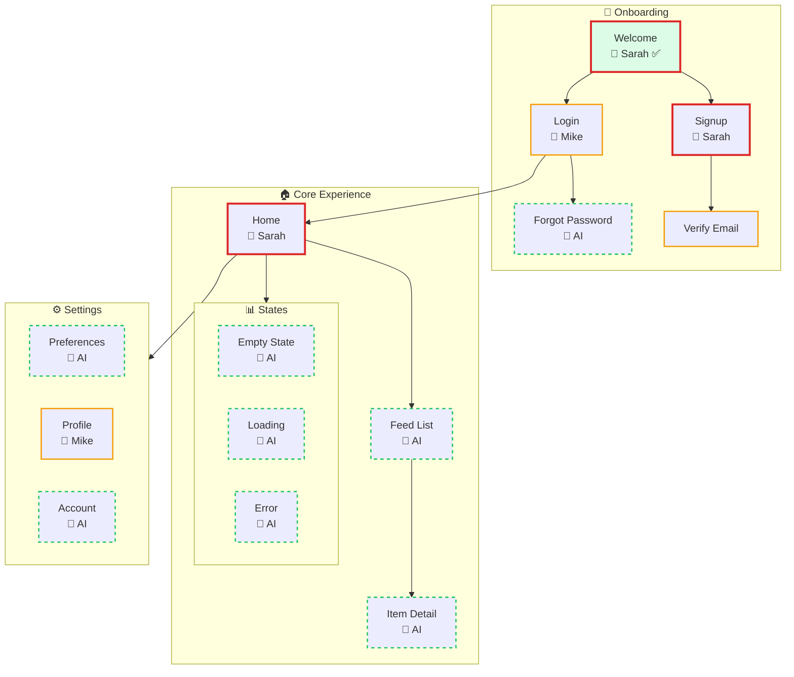
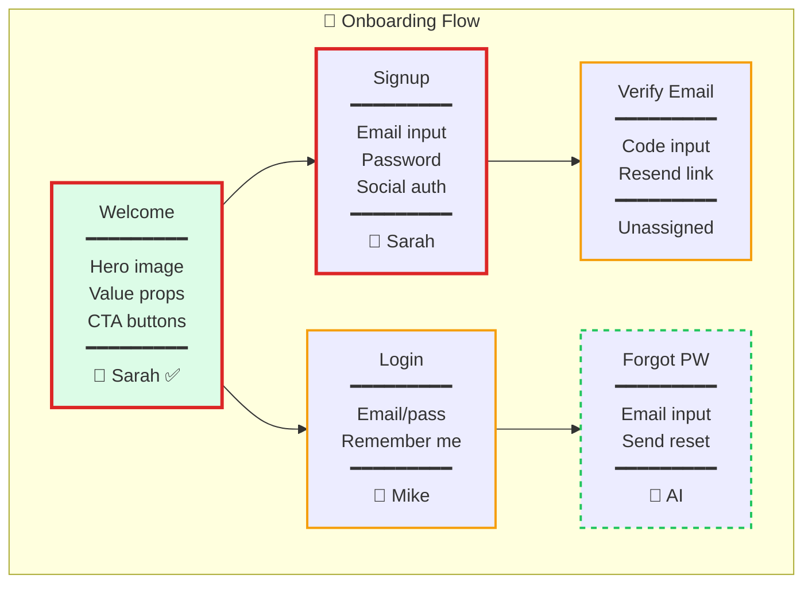

# Product Design Skill - Implementation Plan

## Executive Summary

Create a unified `/product-design` skill that orchestrates design system extraction, screen mapping, and work allocation into a single cohesive workflow. The skill auto-detects project context (new vs. existing) and produces a visual map with AI-suitability indicators.

---

## Core Concept

```
┌─────────────────────────────────────────────────────────────────┐
│                     /product-design                             │
├─────────────────────────────────────────────────────────────────┤
│                                                                 │
│  ┌─────────────┐    ┌─────────────┐    ┌─────────────────────┐ │
│  │   Design    │───▶│   Screen    │───▶│  Work Allocation    │ │
│  │   System    │    │    Map      │    │  (Human vs AI)      │ │
│  │  Extraction │    │ Generation  │    │                     │ │
│  └─────────────┘    └─────────────┘    └─────────────────────┘ │
│       ▲                   ▲                      ▲              │
│       │                   │                      │              │
│       └───────────────────┴──────────────────────┘              │
│                    Shared Context                               │
│                                                                 │
└─────────────────────────────────────────────────────────────────┘
```

---

## Entry Point

When the user invokes `/product-design`, ask what they have:

```
What are you starting with?
A) Screenshots of an existing design      → Visual-first workflow
B) A product idea (no designs yet)        → Concept-first workflow
C) Adding to an existing product map      → Feature workflow
D) Completed hero screens ready for extraction → Extract workflow
```

## Subcommands (Optional Shortcuts)

| Command | Purpose | Input | Output |
|---------|---------|-------|--------|
| `/product-design` | Ask what you have, branch appropriately | - | Appropriate workflow |
| `/product-design plan` | Concept-first: idea → map | Product idea via Q&A | Map skeleton (no design system yet) |
| `/product-design screenshots` | Visual-first: screenshots → map + system | 10-15 screenshots | Complete design system + map |
| `/product-design extract` | Pull design system from completed heroes | Completed screen files | Design system + updated map |
| `/product-design feature "description"` | Add feature to existing product | Feature description | New screens added to map |
| `/product-design map` | Regenerate the mermaid map | Existing inventory | Updated map |
| `/product-design assign` | Interactive assignment mode | Existing map | Updated ownership markers |
| `/product-design status` | Show progress overview | Existing system | Summary of completion state |

---

## Directory Structure

```
.claude/skills/product-design/
├── SKILL.md                          # Main skill definition
├── schemas/
│   ├── product-map.schema.json       # Visual map data structure
│   ├── screen.schema.json            # Individual screen definition
│   ├── flow.schema.json              # Screen-to-screen connections
│   └── ai-suitability.schema.json    # AI classification criteria
├── templates/
│   ├── PRODUCT-MAP.md                # Visual map template
│   ├── screen-inventory.json         # Structured screen data
│   └── feature-delta.md              # Feature addition output
└── examples/
    └── sample-map/
        ├── PRODUCT-MAP.md
        └── screens.json
```

---

## Output Structure

The skill produces a unified output directory:

```
[product-name]/
├── PRODUCT-MAP.md                    # Visual ASCII map (THE key artifact)
├── design-system/
│   ├── tokens/                       # (from existing design-system skill)
│   ├── components/
│   ├── patterns/
│   └── platforms/
├── screens/
│   ├── inventory.json                # All screens with metadata
│   ├── flows.json                    # Connection graph
│   └── sections/                     # Screens grouped by section
│       ├── onboarding/
│       │   ├── login.md
│       │   └── signup.md
│       ├── core/
│       │   ├── home.md
│       │   └── feed.md
│       └── settings/
│           └── preferences.md
├── allocation/
│   ├── DESIGNER-ALLOCATION.md        # (from existing allocation skill)
│   ├── team-roster.json
│   └── screen-scores.json
└── decisions.md                      # Design rationale log
```

---

## The Visual Map (PRODUCT-MAP.md)

This is the hero artifact. It serves as:
1. **IxD Guide** - How screens connect and flow
2. **Assignment Chart** - Who owns what, what's done
3. **AI Suitability View** - What AI can handle

### Map Format (Mermaid)

Uses mermaid flowcharts with styling to indicate AI suitability and status.

```markdown
# Product Map: [App Name]

## Legend

| Style | Meaning | Description |
|-------|---------|-------------|
| 🔴 Red border | Human-critical | Must be human-designed |
| 🟡 Yellow border | Human-preferred | Human recommended, AI could assist |
| 🟢 Green border/dashed | AI-suitable | AI can generate after patterns exist |
| ✅ Filled background | Complete | Screen is done |
| 👤 Name label | Assigned | Shows owner |

## Full Product Map



## Section: Onboarding (Detail View)



## Statistics

| Metric | Count | Percentage |
|--------|-------|------------|
| Total screens | 47 | 100% |
| Human-critical | 12 | 26% |
| Human-preferred | 8 | 17% |
| AI-suitable | 27 | 57% |
| Assigned | 20 | 43% |
| Complete | 8 | 17% |
```

---

## Screen Schema

Each screen has structured metadata:

```json
{
  "id": "onboarding-welcome",
  "name": "Welcome",
  "section": "onboarding",
  "priority": "P0",

  "classification": {
    "type": "human-critical",
    "confidence": "high",
    "reasons": [
      "First impression - establishes brand",
      "Sets emotional tone for entire app",
      "Novel interaction pattern"
    ]
  },

  "scores": {
    "first_impression": 1.0,
    "conversion_impact": 0.8,
    "emotional_peak": 0.9,
    "pattern_setting": 0.7,
    "complexity": 0.4,
    "trust_critical": 0.3,
    "total": 0.78
  },

  "connections": {
    "from": [],
    "to": ["onboarding-signup", "onboarding-login"]
  },

  "assignment": {
    "owner": "sarah",
    "status": "in_progress",
    "due": "week-1"
  },

  "states": ["default", "loading", "error"],
  "components_used": ["hero-image", "button-primary", "text-display"],

  "ai_generation": {
    "suitable": false,
    "after_patterns_from": null,
    "notes": "Must be human-designed - brand-defining moment"
  }
}
```

---

## AI Suitability Classification

### Auto-Classification Rules

```yaml
human_critical:
  triggers:
    - first_5_screens: true
    - is_conversion_screen: true
    - is_emotional_peak: true
    - is_pattern_setter: true
    - is_novel_interaction: true
    - is_trust_critical: true
  score_threshold: "> 0.70"

human_preferred:
  triggers:
    - has_brand_expression: true
    - has_complex_states: true
    - needs_illustration: true
  score_threshold: "0.50 - 0.70"

ai_suitable:
  triggers:
    - is_state_variant: true
    - is_responsive_adaptation: true
    - follows_established_pattern: true
    - is_data_display: true
    - is_crud_screen: true
    - is_repetitive: true
  score_threshold: "< 0.50"
  requires: "Pattern-setting screen complete first"
```

### Visual Indicators in Mermaid Map

| Classification | Mermaid Style | Color | Description |
|----------------|---------------|-------|-------------|
| Human-critical | `stroke-width:3px` solid | 🔴 Red `#dc2626` | Must be human-designed |
| Human-preferred | `stroke-width:2px` solid | 🟡 Yellow `#f59e0b` | Human preferred, AI could assist |
| AI-suitable | `stroke-dasharray: 5 5` dashed | 🟢 Green `#22c55e` | AI can generate after patterns exist |
| Complete | `fill:#dcfce7` green bg | - | Screen is finished |

### Node Label Format

```
["Screen Name<br/>━━━━━━━━━<br/>Key components<br/>listed here<br/>━━━━━━━━━<br/>👤 Owner ✅"]
```

- **Top**: Screen name
- **Middle**: Key components/content (optional, for detail views)
- **Bottom**: Owner + status emoji

---

## Workflow: Create (New Product)

```
1. INPUT COLLECTION
   ├── Screenshots (10-15 hero screens)
   ├── App name and description
   ├── Platform preference (iOS/Android/Web/All)
   └── Optional: Existing brand guidelines

2. DESIGN SYSTEM EXTRACTION
   ├── Analyze screenshots for visual patterns
   ├── Extract tokens (colors, typography, spacing, etc.)
   ├── Identify components and their states
   ├── Ask clarifying questions (A/B/C format)
   └── Generate design-system/ directory

3. SCREEN DISCOVERY
   ├── Identify all unique screens in screenshots
   ├── Infer additional screens (states, flows, settings)
   ├── Ask about missing screens ("Do you have a profile page?")
   └── Build complete screen inventory

4. FLOW MAPPING
   ├── Determine screen connections
   ├── Identify entry points and dead ends
   ├── Map primary and secondary flows
   └── Group screens into logical sections

5. AI SUITABILITY SCORING
   ├── Score each screen on 6 factors
   ├── Apply classification rules
   ├── Identify pattern dependencies
   └── Calculate human vs AI split

6. MAP GENERATION
   ├── Generate ASCII visual map
   ├── Include legend and statistics
   ├── Show AI suitability with border styles
   └── Write PRODUCT-MAP.md

7. OPTIONAL: TEAM ALLOCATION
   ├── Ask about team composition
   ├── Generate assignment recommendations
   ├── Add assignments to map
   └── Write allocation/ files
```

---

## Workflow: Feature (Existing Product)

```
1. CONTEXT DETECTION
   ├── Auto-detect existing design system location
   ├── Read current PRODUCT-MAP.md
   ├── Load screens/inventory.json
   └── Understand existing patterns

2. FEATURE ANALYSIS
   ├── Parse feature description
   ├── Ask clarifying questions about scope
   ├── Identify which sections it touches
   └── Determine new screens needed

3. SCREEN DEFINITION
   ├── Define new screens with metadata
   ├── Score for AI suitability
   ├── Identify connections to existing screens
   └── Determine if new patterns are needed

4. MAP UPDATE
   ├── Insert new screens into appropriate sections
   ├── Show connections to existing screens
   ├── Highlight as "NEW" or different color
   └── Update statistics

5. DELTA OUTPUT
   ├── Generate feature-delta.md showing changes
   ├── List new screens with classifications
   ├── Show updated map section
   └── Suggest assignment for new screens

6. OPTIONAL: NEW COMPONENTS
   ├── If feature needs new components
   ├── Add to design-system/components/
   ├── Reference new tokens if needed
   └── Update component index
```

---

## Phase 1: Core Implementation

### Files to Create

| File | Purpose | Priority |
|------|---------|----------|
| `SKILL.md` | Main skill definition with all workflows | P0 |
| `schemas/product-map.schema.json` | Map data structure | P0 |
| `schemas/screen.schema.json` | Screen metadata | P0 |
| `templates/PRODUCT-MAP.md` | Map output template | P0 |
| `templates/screen-inventory.json` | Inventory template | P1 |

### SKILL.md Structure

```markdown
# Product Design Skill

<system>
You are a product design expert...
</system>

## Trigger
/product-design [subcommand] [args]

## Context Detection
[Logic to detect new vs existing project]

## Workflows

### Create Workflow
[Full extraction + mapping flow]

### Feature Workflow
[Incremental addition flow]

### Map Workflow
[Regenerate visual map]

## Output Formats
[Templates for each output type]

## Clarifying Questions
[Standard questions with A/B/C/D format]
```

---

## Phase 2: Integration

### Reuse from Existing Skills

| Existing Skill | What to Reuse | How |
|----------------|---------------|-----|
| `/design-system` | Token extraction, component analysis | Import workflow steps |
| `/designer-allocation` | Scoring algorithm, team Q&A | Import scoring logic |

### Integration Approach

1. **Don't duplicate** - Reference existing skill logic
2. **Orchestrate** - Product-design skill calls into existing workflows
3. **Extend** - Add map generation as new capability
4. **Unify output** - Single directory structure

---

## Phase 3: Enhancements

### Future Subcommands

| Command | Purpose |
|---------|---------|
| `/product-design export figma` | Export to Figma tokens format |
| `/product-design export storybook` | Generate Storybook stories |
| `/product-design diff` | Compare two versions of the map |
| `/product-design handoff [screen]` | Generate developer handoff doc |

### Future Features

- **Interactive map navigation** - Click to drill into sections
- **Progress tracking** - Check off completed screens
- **Dependency warnings** - Alert when AI screen's pattern isn't done
- **Timeline view** - Gantt-style week-by-week breakdown

---

## Implementation Order

```
Week 1: Foundation
├── [ ] Create SKILL.md with create workflow
├── [ ] Define product-map.schema.json
├── [ ] Define screen.schema.json
├── [ ] Create PRODUCT-MAP.md template
└── [ ] Test with sample screenshots

Week 2: Feature Flow
├── [ ] Add context detection logic
├── [ ] Implement feature subcommand
├── [ ] Create feature-delta.md template
├── [ ] Handle map updates
└── [ ] Test with existing system

Week 3: Integration
├── [ ] Integrate design-system extraction
├── [ ] Integrate allocation scoring
├── [ ] Add assign subcommand
├── [ ] Add status subcommand
└── [ ] End-to-end testing

Week 4: Polish
├── [ ] Refine AI suitability classification
├── [ ] Improve map visual layout
├── [ ] Add validation
├── [ ] Documentation
└── [ ] Example outputs
```

---

## Success Criteria

1. **Single command** starts full workflow for new products
2. **Auto-detection** correctly identifies new vs existing projects
3. **Visual map** clearly shows AI suitability at a glance
4. **Feature additions** seamlessly update existing maps
5. **Assignments** visible directly on the map
6. **No duplication** - reuses existing skill logic

---

## Open Questions

1. **Screen detail** - How much detail per screen in the map vs. separate files? (Plan shows both overview and detail view options)
2. **State variants** - Show inline in subgraphs or in separate "States" section?
3. **Large maps** - How to handle 100+ screen products? Options:
   - Break into multiple mermaid diagrams by section
   - Use collapsible subgraphs (if renderer supports)
   - Generate both overview (section boxes only) and detailed views
4. **Mermaid rendering** - Should we include instructions for where to render (GitHub, VS Code extension, Mermaid Live)?

---

## Appendix: Sample Clarifying Questions

### For Create Flow

```
Q: How many main sections does this app have?
A) 3-4 (simple app)
B) 5-7 (medium complexity)
C) 8+ (complex app)
D) Let me describe them...
```

```
Q: Does this app have user-generated content?
A) Yes, users create/post content
B) No, content is curated/static
C) Mixed - some user, some curated
```

### For Feature Flow

```
Q: Where does this feature connect to the existing app?
A) New tab/section (top-level addition)
B) Within existing section: [section name]
C) Accessible from multiple places
D) Let me explain...
```

```
Q: Does this feature need new visual components?
A) No, uses existing components only
B) Yes, needs 1-2 new components
C) Yes, needs significant new components
D) Not sure yet
```
