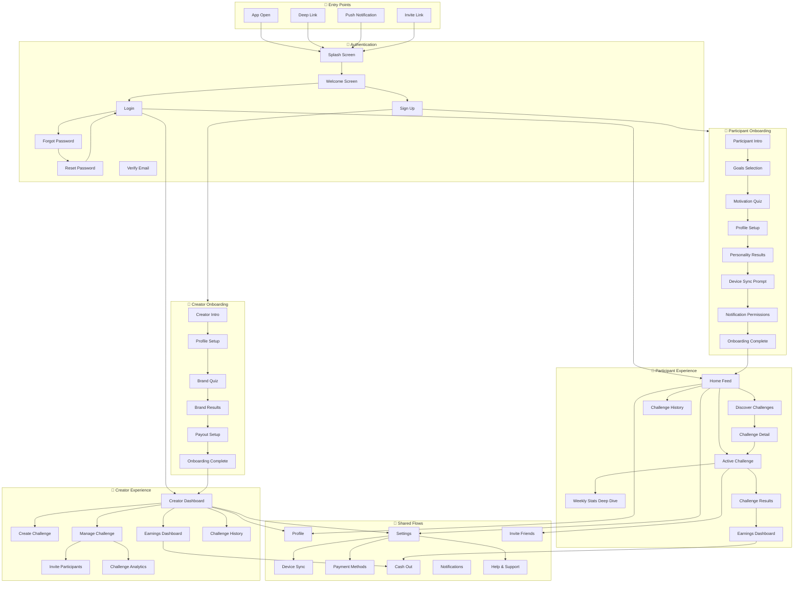

# Motiv App Flow Map

## Overview

This document maps every screen, state, and component in the Motiv app. Use it to:
- Assign designers to specific sections
- Track completion status
- Identify gaps that need AI fill-in

**Two user types:**
- **Creators** — Influencers who create and manage challenges
- **Participants** — Users who join and complete challenges

---

## How to Read This Map

### States per Screen

Every screen should account for:
| State | Description |
|-------|-------------|
| `default` | Normal filled state |
| `loading` | Data is being fetched |
| `empty` | No data to display |
| `error` | Something went wrong |
| `offline` | No network connection |

### Assignment Format

```
[Screen Name]
├── Status: 🔴 Not started / 🟡 In progress / 🟢 Complete
├── Assigned: [Designer name or "AI"]
├── Priority: P0/P1/P2/P3
└── Notes: [Any context]
```

---

## Master Flow Diagram



---

## Detailed Screen Inventory

### 🔐 Authentication

#### AUTH-001: Splash Screen
| Attribute | Value |
|-----------|-------|
| **Status** | 🔴 Not started |
| **Assigned** | — |
| **Priority** | P0 |
| **States** | default, loading |
| **Components** | Logo animation, loading indicator |
| **Transitions** | → Welcome (new user), → Home (returning user) |
| **Notes** | Check auth token, determine user type |

#### AUTH-002: Welcome Screen
| Attribute | Value |
|-----------|-------|
| **Status** | 🟢 Complete (from screenshots) |
| **Assigned** | Original design |
| **Priority** | P0 |
| **States** | default |
| **Components** | Logo, tagline, CTA buttons, testimonial card |
| **Modals** | — |
| **Notes** | Animated gradient background |

#### AUTH-003: Sign Up - Method Selection
| Attribute | Value |
|-----------|-------|
| **Status** | 🔴 Not started |
| **Assigned** | — |
| **Priority** | P0 |
| **States** | default, loading, error |
| **Components** | Email input, Apple sign-in, Google sign-in, Terms checkbox |
| **Modals** | Terms of Service, Privacy Policy |
| **Error States** | Email taken, invalid email, OAuth failed |

#### AUTH-004: Sign Up - User Type Selection
| Attribute | Value |
|-----------|-------|
| **Status** | 🔴 Not started |
| **Assigned** | — |
| **Priority** | P0 |
| **States** | default |
| **Components** | Creator card, Participant card, explanation text |
| **Notes** | Determines which onboarding flow |

#### AUTH-005: Login
| Attribute | Value |
|-----------|-------|
| **Status** | 🔴 Not started |
| **Assigned** | — |
| **Priority** | P0 |
| **States** | default, loading, error |
| **Components** | Email input, password input, login button, forgot password link, OAuth buttons |
| **Error States** | Invalid credentials, account locked, unverified email |

#### AUTH-006: Forgot Password
| Attribute | Value |
|-----------|-------|
| **Status** | 🔴 Not started |
| **Assigned** | — |
| **Priority** | P1 |
| **States** | default, loading, success, error |
| **Components** | Email input, submit button, back link |
| **Success State** | "Check your email" confirmation |
| **Error States** | Email not found, rate limited |

#### AUTH-007: Reset Password
| Attribute | Value |
|-----------|-------|
| **Status** | 🔴 Not started |
| **Assigned** | — |
| **Priority** | P1 |
| **States** | default, loading, success, error, expired |
| **Components** | New password input, confirm password, strength indicator, submit |
| **Error States** | Passwords don't match, too weak, link expired |

#### AUTH-008: Verify Email
| Attribute | Value |
|-----------|-------|
| **Status** | 🔴 Not started |
| **Assigned** | — |
| **Priority** | P1 |
| **States** | pending, success, error, resent |
| **Components** | Status message, resend button, check spam hint |
| **Notes** | May be interstitial or modal |

---

### 👑 Creator Onboarding

#### CO-001: Creator Intro
| Attribute | Value |
|-----------|-------|
| **Status** | 🔴 Not started |
| **Assigned** | — |
| **Priority** | P0 |
| **States** | default |
| **Components** | Value prop cards, carousel/pagination, CTA |
| **Notes** | Explain what creators can do, earnings potential |

#### CO-002: Creator Profile Setup
| Attribute | Value |
|-----------|-------|
| **Status** | 🔴 Not started |
| **Assigned** | — |
| **Priority** | P0 |
| **States** | default, loading, error |
| **Components** | Avatar upload, display name, handle input, bio textarea, social links |
| **Modals** | Image cropper |
| **Error States** | Handle taken, image upload failed |

#### CO-003: Brand Quiz
| Attribute | Value |
|-----------|-------|
| **Status** | 🔴 Not started |
| **Assigned** | — |
| **Priority** | P0 |
| **States** | default (per question) |
| **Components** | Question text, answer options (multi-select), progress indicator, next button |
| **Notes** | Similar to participant motivation quiz |

#### CO-004: Brand Results
| Attribute | Value |
|-----------|-------|
| **Status** | 🔴 Not started |
| **Assigned** | — |
| **Priority** | P0 |
| **States** | default, loading |
| **Components** | Brand archetype card, description, color suggestions, sample challenge preview |
| **Notes** | Animated gradient background like participant results |

#### CO-005: Payout Setup
| Attribute | Value |
|-----------|-------|
| **Status** | 🔴 Not started |
| **Assigned** | — |
| **Priority** | P0 |
| **States** | default, loading, success, error |
| **Components** | Bank account or Stripe Connect, tax info collection, skip option |
| **Modals** | Stripe Connect flow (external) |
| **Notes** | Can be completed later |

#### CO-006: Creator Onboarding Complete
| Attribute | Value |
|-----------|-------|
| **Status** | 🔴 Not started |
| **Assigned** | — |
| **Priority** | P0 |
| **States** | default |
| **Components** | Celebration animation, summary card, "Create First Challenge" CTA |
| **Notes** | Confetti or similar celebration |

---

### 🏃 Participant Onboarding

#### PO-001: Participant Intro
| Attribute | Value |
|-----------|-------|
| **Status** | 🔴 Not started |
| **Assigned** | — |
| **Priority** | P0 |
| **States** | default |
| **Components** | Value prop slides, pagination dots, skip link |

#### PO-002: Goals Selection
| Attribute | Value |
|-----------|-------|
| **Status** | 🔴 Not started |
| **Assigned** | — |
| **Priority** | P0 |
| **States** | default |
| **Components** | Goal chips (multi-select), categories, next button |
| **Notes** | "What do you want to achieve?" |

#### PO-003: Motivation Quiz
| Attribute | Value |
|-----------|-------|
| **Status** | 🟢 Complete (from screenshots) |
| **Assigned** | Original design |
| **Priority** | P0 |
| **States** | default |
| **Components** | Question, multi-select answers with checkmarks, progress, next button |
| **Notes** | "What motivates you?" |

#### PO-004: Profile Setup
| Attribute | Value |
|-----------|-------|
| **Status** | 🟢 Complete (from screenshots) |
| **Assigned** | Original design |
| **Priority** | P0 |
| **States** | default, loading |
| **Components** | Avatar upload, display name, handle, follower count display |
| **Notes** | "You've built something special" |

#### PO-005: Personality Results (Screen 1)
| Attribute | Value |
|-----------|-------|
| **Status** | 🟢 Complete (from screenshots) |
| **Assigned** | Original design |
| **Priority** | P0 |
| **States** | default |
| **Components** | Headline, personality trait card, explanation text |
| **Notes** | "Why people listen to you" - Mint gradient |

#### PO-006: Personality Results (Screen 2)
| Attribute | Value |
|-----------|-------|
| **Status** | 🟢 Complete (from screenshots) |
| **Assigned** | Original design |
| **Priority** | P0 |
| **States** | default |
| **Components** | Brand traits, visual style description |
| **Notes** | "Your brand, visually" - Yellow gradient |

#### PO-007: Device Sync Prompt
| Attribute | Value |
|-----------|-------|
| **Status** | 🔴 Not started |
| **Assigned** | — |
| **Priority** | P0 |
| **States** | default |
| **Components** | Device/app icons (Fitbit, Strava, Peloton, Apple Health), connect buttons, skip |
| **Notes** | Can connect later in settings |

#### PO-008: Notification Permissions
| Attribute | Value |
|-----------|-------|
| **Status** | 🔴 Not started |
| **Assigned** | — |
| **Priority** | P1 |
| **States** | default, granted, denied |
| **Components** | Explanation of notification types, enable button, skip |
| **Modals** | System permission dialog |

#### PO-009: Onboarding Complete
| Attribute | Value |
|-----------|-------|
| **Status** | 🔴 Not started |
| **Assigned** | — |
| **Priority** | P0 |
| **States** | default |
| **Components** | Welcome message, suggested challenges, "Explore" CTA |

---

### 👑 Creator Main Experience

#### C-HOME-001: Creator Dashboard
| Attribute | Value |
|-----------|-------|
| **Status** | 🔴 Not started |
| **Assigned** | — |
| **Priority** | P0 |
| **States** | default, loading, empty, error |
| **Components** | Active challenges summary, earnings overview, quick actions, recent activity |
| **Empty State** | No challenges yet → CTA to create first |

#### C-CREATE-001: Create Challenge - Type Selection
| Attribute | Value |
|-----------|-------|
| **Status** | 🔴 Not started |
| **Assigned** | — |
| **Priority** | P0 |
| **States** | default |
| **Components** | Challenge type cards (fitness, wellness, etc.), templates |

#### C-CREATE-002: Create Challenge - Basic Info
| Attribute | Value |
|-----------|-------|
| **Status** | 🔴 Not started |
| **Assigned** | — |
| **Priority** | P0 |
| **States** | default, error |
| **Components** | Title input, description, dates picker, cover image upload |
| **Error States** | Title too long, dates invalid, image too large |

#### C-CREATE-003: Create Challenge - Goals & Rules
| Attribute | Value |
|-----------|-------|
| **Status** | 🔴 Not started |
| **Assigned** | — |
| **Priority** | P0 |
| **States** | default |
| **Components** | Goal type selector, target input (days, kJ, etc.), tracking method, rules editor |

#### C-CREATE-004: Create Challenge - Pricing
| Attribute | Value |
|-----------|-------|
| **Status** | 🔴 Not started |
| **Assigned** | — |
| **Priority** | P0 |
| **States** | default |
| **Components** | Entry fee input, prize pool calculator, payout structure preview |

#### C-CREATE-005: Create Challenge - Theme Selection
| Attribute | Value |
|-----------|-------|
| **Status** | 🔴 Not started |
| **Assigned** | — |
| **Priority** | P0 |
| **States** | default |
| **Components** | Color palette picker (14 options), font picker (7 options), preview card |
| **Notes** | Uses challenge-theme-tokens.json |

#### C-CREATE-006: Create Challenge - Preview & Publish
| Attribute | Value |
|-----------|-------|
| **Status** | 🔴 Not started |
| **Assigned** | — |
| **Priority** | P0 |
| **States** | default, loading, success, error |
| **Components** | Full challenge preview, edit buttons per section, publish CTA |
| **Modals** | Publish confirmation |

#### C-MANAGE-001: Challenge Management - Overview
| Attribute | Value |
|-----------|-------|
| **Status** | 🔴 Not started |
| **Assigned** | — |
| **Priority** | P0 |
| **States** | pre-active, active, completed, loading, error |
| **Components** | Status badge, participant count, time remaining, quick stats |

#### C-MANAGE-002: Challenge Management - Participants
| Attribute | Value |
|-----------|-------|
| **Status** | 🔴 Not started |
| **Assigned** | — |
| **Priority** | P0 |
| **States** | default, loading, empty |
| **Components** | Participant list, search, filter (on-track/behind), progress indicators |
| **Empty State** | No participants yet → share link |

#### C-MANAGE-003: Challenge Management - Leaderboard
| Attribute | Value |
|-----------|-------|
| **Status** | 🔴 Not started |
| **Assigned** | — |
| **Priority** | P1 |
| **States** | default, loading, empty |
| **Components** | Ranked list, progress bars, top 3 highlight |

#### C-MANAGE-004: Challenge Management - Messages
| Attribute | Value |
|-----------|-------|
| **Status** | 🔴 Not started |
| **Assigned** | — |
| **Priority** | P1 |
| **States** | default, loading, empty |
| **Components** | Message composer, scheduled messages, sent history |
| **Notes** | Creator can send encouragement to all participants |

#### C-INVITE-001: Invite Participants
| Attribute | Value |
|-----------|-------|
| **Status** | 🔴 Not started |
| **Assigned** | — |
| **Priority** | P0 |
| **States** | default |
| **Components** | Share link, copy button, social share buttons, QR code |
| **Modals** | System share sheet |

#### C-ANALYTICS-001: Challenge Analytics
| Attribute | Value |
|-----------|-------|
| **Status** | 🔴 Not started |
| **Assigned** | — |
| **Priority** | P1 |
| **States** | default, loading, empty |
| **Components** | Participation rate, completion rate, engagement graph, revenue breakdown |

#### C-EARNINGS-001: Creator Earnings Dashboard
| Attribute | Value |
|-----------|-------|
| **Status** | 🔴 Not started |
| **Assigned** | — |
| **Priority** | P0 |
| **States** | default, loading, empty |
| **Components** | Total earnings, pending/available balance, earnings history, cash out CTA |
| **Empty State** | No earnings yet |

#### C-HISTORY-001: Challenge History
| Attribute | Value |
|-----------|-------|
| **Status** | 🔴 Not started |
| **Assigned** | — |
| **Priority** | P1 |
| **States** | default, loading, empty |
| **Components** | Past challenge cards, filter by status, search |
| **Empty State** | No past challenges |

---

### 🏃 Participant Main Experience

#### P-HOME-001: Home Feed
| Attribute | Value |
|-----------|-------|
| **Status** | 🔴 Not started |
| **Assigned** | — |
| **Priority** | P0 |
| **States** | default, loading, empty, error |
| **Components** | Active challenge card (prominent), upcoming challenges, recommended, community activity |
| **Empty State** | No active challenges → discover CTA |

#### P-DISCOVER-001: Discover Challenges
| Attribute | Value |
|-----------|-------|
| **Status** | 🔴 Not started |
| **Assigned** | — |
| **Priority** | P0 |
| **States** | default, loading, empty, error |
| **Components** | Search bar, category filters, challenge cards, creator spotlights |
| **Empty State** | No matching challenges |

#### P-DISCOVER-002: Search Results
| Attribute | Value |
|-----------|-------|
| **Status** | 🔴 Not started |
| **Assigned** | — |
| **Priority** | P1 |
| **States** | default, loading, empty |
| **Components** | Results list, filters, sort options |
| **Empty State** | No results found → suggestions |

#### P-DETAIL-001: Challenge Detail - Pre-Join
| Attribute | Value |
|-----------|-------|
| **Status** | 🔴 Not started |
| **Assigned** | — |
| **Priority** | P0 |
| **States** | default, loading, error |
| **Components** | Hero image, creator info, description, rules, dates, pricing, participant count, join CTA |
| **Notes** | Themed with challenge colors |

#### P-DETAIL-002: Challenge Detail - Join Flow
| Attribute | Value |
|-----------|-------|
| **Status** | 🔴 Not started |
| **Assigned** | — |
| **Priority** | P0 |
| **States** | default, loading, success, error |
| **Components** | Payment summary, payment method selector, confirm button |
| **Modals** | Payment processing, success confirmation |
| **Error States** | Payment failed, already joined, challenge full |

#### P-ACTIVE-001: Active Challenge Dashboard
| Attribute | Value |
|-----------|-------|
| **Status** | 🟢 Complete (from screenshots) |
| **Assigned** | Original design |
| **Priority** | P0 |
| **States** | default, loading, error, syncing |
| **Components** | Value display, refund/reward breakdown, weekly progress, day indicators, kJ progress, community stats |
| **Notes** | Main challenge screen with expandable sections |

#### P-ACTIVE-002: Active Challenge - Expanded Progress
| Attribute | Value |
|-----------|-------|
| **Status** | 🟢 Complete (from screenshots) |
| **Assigned** | Original design |
| **Priority** | P0 |
| **States** | default |
| **Components** | Week-by-week breakdown, daily log, sync button, full details link |

#### P-ACTIVE-003: Active Challenge - Community Stats
| Attribute | Value |
|-----------|-------|
| **Status** | 🟢 Complete (from screenshots) |
| **Assigned** | Original design |
| **Priority** | P1 |
| **States** | default, loading |
| **Components** | Community pool, active participants, live indicator |

#### P-ACTIVE-004: Active Challenge - Recommendations
| Attribute | Value |
|-----------|-------|
| **Status** | 🟢 Complete (from screenshots) |
| **Assigned** | Original design |
| **Priority** | P2 |
| **States** | default, loading, empty |
| **Components** | "What keeps me on track" section, product cards with categories |

#### P-ACTIVE-005: Active Challenge - Community Feed
| Attribute | Value |
|-----------|-------|
| **Status** | 🔴 Not started |
| **Assigned** | — |
| **Priority** | P1 |
| **States** | default, loading, empty |
| **Components** | Post cards, reactions, comments preview |
| **Empty State** | Be the first to post |

#### P-STATS-001: Weekly Stats Deep Dive
| Attribute | Value |
|-----------|-------|
| **Status** | 🔴 Not started |
| **Assigned** | — |
| **Priority** | P0 |
| **States** | default, loading, empty |
| **Components** | Daily breakdown, workout log, kJ chart, streak indicator |

#### P-STATS-002: Daily Log Detail
| Attribute | Value |
|-----------|-------|
| **Status** | 🔴 Not started |
| **Assigned** | — |
| **Priority** | P1 |
| **States** | default, loading, error |
| **Components** | Workout list, source (Peloton, etc.), duration, kJ, time |

#### P-RESULTS-001: Challenge Results - Winner
| Attribute | Value |
|-----------|-------|
| **Status** | 🟢 Complete (from screenshots) |
| **Assigned** | Original design |
| **Priority** | P0 |
| **States** | default |
| **Components** | Celebration header, creator message, earnings breakdown, stats summary, share CTA |
| **Notes** | Dark celebration background |

#### P-RESULTS-002: Challenge Results - Incomplete
| Attribute | Value |
|-----------|-------|
| **Status** | 🟢 Complete (from screenshots) |
| **Assigned** | Original design |
| **Priority** | P0 |
| **States** | default |
| **Components** | Result header, creator message, what happened, partial refund, stats, try again CTA |
| **Notes** | Dark celebration background, encouraging tone |

#### P-RESULTS-003: Challenge Results - Stats Detail
| Attribute | Value |
|-----------|-------|
| **Status** | 🟢 Complete (from screenshots) |
| **Assigned** | Original design |
| **Priority** | P1 |
| **States** | default |
| **Components** | Total output, challenge winners, comments, high fives, full details button |

#### P-EARNINGS-001: Participant Earnings Dashboard
| Attribute | Value |
|-----------|-------|
| **Status** | 🔴 Not started |
| **Assigned** | — |
| **Priority** | P0 |
| **States** | default, loading, empty |
| **Components** | Available balance, pending, earnings history, cash out CTA |
| **Empty State** | No earnings yet → join challenge CTA |

#### P-HISTORY-001: Challenge History
| Attribute | Value |
|-----------|-------|
| **Status** | 🔴 Not started |
| **Assigned** | — |
| **Priority** | P1 |
| **States** | default, loading, empty |
| **Components** | Past challenge cards, won/lost badges, filter |
| **Empty State** | No past challenges |

---

### 🔄 Shared Flows

#### PROFILE-001: My Profile
| Attribute | Value |
|-----------|-------|
| **Status** | 🔴 Not started |
| **Assigned** | — |
| **Priority** | P0 |
| **States** | default, loading |
| **Components** | Avatar, name, handle, bio, stats (challenges, wins), edit button |

#### PROFILE-002: Edit Profile
| Attribute | Value |
|-----------|-------|
| **Status** | 🔴 Not started |
| **Assigned** | — |
| **Priority** | P1 |
| **States** | default, loading, success, error |
| **Components** | Avatar upload, name input, handle input, bio textarea, save button |
| **Modals** | Image cropper, discard changes confirmation |

#### PROFILE-003: Other User Profile
| Attribute | Value |
|-----------|-------|
| **Status** | 🔴 Not started |
| **Assigned** | — |
| **Priority** | P2 |
| **States** | default, loading, error |
| **Components** | Avatar, name, stats, their challenges (if creator), follow button |

#### SETTINGS-001: Settings Main
| Attribute | Value |
|-----------|-------|
| **Status** | 🔴 Not started |
| **Assigned** | — |
| **Priority** | P0 |
| **States** | default |
| **Components** | Section list (Account, Devices, Payments, Notifications, Help, Legal), logout |

#### SETTINGS-002: Account Settings
| Attribute | Value |
|-----------|-------|
| **Status** | 🔴 Not started |
| **Assigned** | — |
| **Priority** | P1 |
| **States** | default |
| **Components** | Email, password change, delete account |
| **Modals** | Change password, delete confirmation |

#### SETTINGS-003: Notification Settings
| Attribute | Value |
|-----------|-------|
| **Status** | 🔴 Not started |
| **Assigned** | — |
| **Priority** | P1 |
| **States** | default |
| **Components** | Toggle list (challenge updates, reminders, social, marketing) |

#### SYNC-001: Device Sync - Main
| Attribute | Value |
|-----------|-------|
| **Status** | 🔴 Not started |
| **Assigned** | — |
| **Priority** | P0 |
| **States** | default, loading |
| **Components** | Connected devices list, add device button, sync status |
| **Empty State** | No devices connected |

#### SYNC-002: Device Sync - Add Device
| Attribute | Value |
|-----------|-------|
| **Status** | 🔴 Not started |
| **Assigned** | — |
| **Priority** | P0 |
| **States** | default, connecting, success, error |
| **Components** | Device/app list (Fitbit, Strava, Peloton, Apple Health, Google Fit), connect buttons |
| **Modals** | OAuth flow (external), connection success |
| **Error States** | Connection failed, already connected |

#### SYNC-003: Device Sync - Device Detail
| Attribute | Value |
|-----------|-------|
| **Status** | 🔴 Not started |
| **Assigned** | — |
| **Priority** | P2 |
| **States** | default, syncing |
| **Components** | Last sync time, data pulled, disconnect button, manual sync |

#### PAYMENTS-001: Payment Methods
| Attribute | Value |
|-----------|-------|
| **Status** | 🔴 Not started |
| **Assigned** | — |
| **Priority** | P0 |
| **States** | default, loading, empty |
| **Components** | Saved cards list, add card button, default indicator |
| **Empty State** | No payment methods |

#### PAYMENTS-002: Add Payment Method
| Attribute | Value |
|-----------|-------|
| **Status** | 🔴 Not started |
| **Assigned** | — |
| **Priority** | P0 |
| **States** | default, loading, success, error |
| **Components** | Card input (Stripe Elements), Apple Pay setup, save button |
| **Error States** | Invalid card, declined |

#### CASHOUT-001: Cash Out
| Attribute | Value |
|-----------|-------|
| **Status** | 🔴 Not started |
| **Assigned** | — |
| **Priority** | P0 |
| **States** | default, loading, success, error |
| **Components** | Available balance, amount input, destination selector, confirm button |
| **Modals** | Processing, success confirmation |
| **Error States** | Insufficient balance, payout failed |

#### CASHOUT-002: Cash Out - Add Destination
| Attribute | Value |
|-----------|-------|
| **Status** | 🔴 Not started |
| **Assigned** | — |
| **Priority** | P0 |
| **States** | default, loading, success, error |
| **Components** | Bank account input, or PayPal/Venmo connect |

#### NOTIF-001: Notifications List
| Attribute | Value |
|-----------|-------|
| **Status** | 🔴 Not started |
| **Assigned** | — |
| **Priority** | P1 |
| **States** | default, loading, empty |
| **Components** | Notification cards, unread indicators, mark all read |
| **Empty State** | All caught up |

#### NOTIF-002: Notification Detail
| Attribute | Value |
|-----------|-------|
| **Status** | 🔴 Not started |
| **Assigned** | — |
| **Priority** | P2 |
| **States** | default |
| **Components** | Full notification content, action buttons, timestamp |

#### HELP-001: Help & Support
| Attribute | Value |
|-----------|-------|
| **Status** | 🔴 Not started |
| **Assigned** | — |
| **Priority** | P2 |
| **States** | default |
| **Components** | FAQ categories, search, contact support button |

#### HELP-002: FAQ Category
| Attribute | Value |
|-----------|-------|
| **Status** | 🔴 Not started |
| **Assigned** | — |
| **Priority** | P2 |
| **States** | default, loading |
| **Components** | Question list (expandable), back button |

#### HELP-003: Contact Support
| Attribute | Value |
|-----------|-------|
| **Status** | 🔴 Not started |
| **Assigned** | — |
| **Priority** | P2 |
| **States** | default, loading, success |
| **Components** | Subject dropdown, message textarea, screenshot upload, submit |

#### INVITE-001: Invite Friends
| Attribute | Value |
|-----------|-------|
| **Status** | 🔴 Not started |
| **Assigned** | — |
| **Priority** | P1 |
| **States** | default |
| **Components** | Referral link, copy button, share buttons, contacts picker, rewards explanation |
| **Modals** | System share sheet |

#### LEGAL-001: Terms of Service
| Attribute | Value |
|-----------|-------|
| **Status** | 🔴 Not started |
| **Assigned** | — |
| **Priority** | P3 |
| **States** | default |
| **Components** | Legal text, scroll |

#### LEGAL-002: Privacy Policy
| Attribute | Value |
|-----------|-------|
| **Status** | 🔴 Not started |
| **Assigned** | — |
| **Priority** | P3 |
| **States** | default |
| **Components** | Legal text, scroll |

---

## Screen Count Summary

| Section | Screens | States |
|---------|---------|--------|
| Authentication | 8 | 24 |
| Creator Onboarding | 6 | 14 |
| Participant Onboarding | 9 | 18 |
| Creator Main | 14 | 42 |
| Participant Main | 16 | 48 |
| Shared | 22 | 58 |
| **TOTAL** | **75** | **204** |

---

## Priority Guide

| Priority | Meaning | Target |
|----------|---------|--------|
| P0 | Must have for launch | Designer + AI |
| P1 | Important, soon after | AI fill-in |
| P2 | Nice to have | AI fill-in |
| P3 | Future/low priority | AI fill-in later |

---

## Assignment Workflow

1. **Designer creates hero screens** for assigned section (3-5 screens)
2. **AI extracts patterns** from hero screens
3. **AI generates remaining screens** in that section
4. **AI applies design system** for consistency
5. **Designer reviews** AI output, requests tweaks
6. **AI harmonizes** across all sections

---

## Changelog

| Version | Changes |
|---------|---------|
| 1.0 | Initial flow map with 75 screens |
